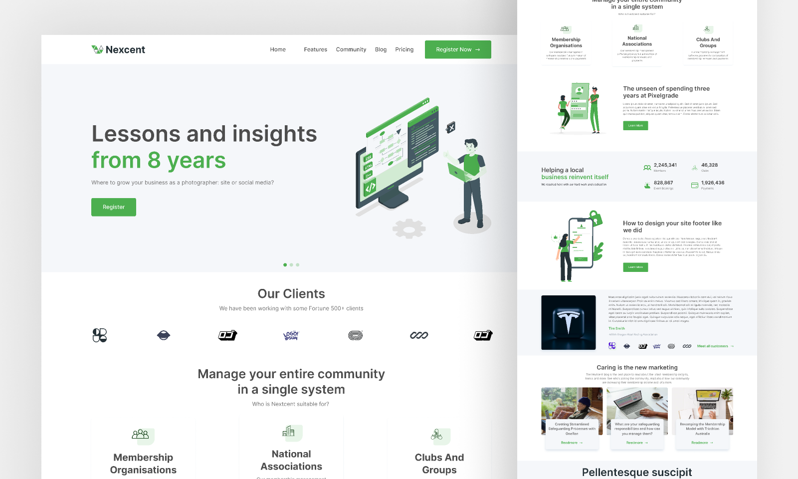

# Nexcent - Agency Landing Page



A modern, responsive landing page built with Next.js 15, Tailwind CSS, and TypeScript. Perfect for agencies, startups, and businesses looking for a professional web presence.

## 🚀 Live Demo

Check out the live demo: [https://agency-landing-lime.vercel.app/](https://agency-landing-lime.vercel.app/)

## ✨ Features

- 📱 Fully responsive design
- 🎨 Modern UI with Tailwind CSS
- ⚡ Built with Next.js 15 and TypeScript
- 🎯 SEO optimized
- 🔧 Easy to customize
- 📦 Modular component structure

## 🛠️ Tech Stack

- [Next.js 15](https://nextjs.org/)
- [TypeScript](https://www.typescriptlang.org/)
- [Tailwind CSS](https://tailwindcss.com/)
- [Lucide Icons](https://lucide.dev/)
- [shadcn/ui](https://ui.shadcn.com/)

## 🚀 Quick Start

1. Clone the repository:

   ```bash
   git clone https://github.com/anibalalpizar/nextjs-agency-landing
   ```

2. Install dependencies:

   ```bash
   npm install
   ```

3. Run the development server:

   ```bash
   npm run dev
   ```

4. Open [http://localhost:3000](http://localhost:3000) in your browser.

## 🎨 Design Credits

This project is based on the Figma design by [Muntasir Billah](https://www.figma.com/@itsmuntasirb).

- [Original Figma Design](https://www.figma.com/community/file/1222060007934600841/responsive-landing-page-design-website-home-page-design-agency-website-ui-design)

## 🤝 Contributing

Contributions are welcome! Feel free to:

1. Fork the repository
2. Create a new branch
3. Make your changes
4. Submit a pull request

## 📝 License

This project is open source and available under the [MIT License](LICENSE).

## 🙏 Acknowledgments

- Design by [Muntasir Billah](https://www.figma.com/@itsmuntasirb)
- Built with [Next.js](https://nextjs.org/)
- Icons by [Lucide](https://lucide.dev/)
- UI Components by [shadcn/ui](https://ui.shadcn.com/)
